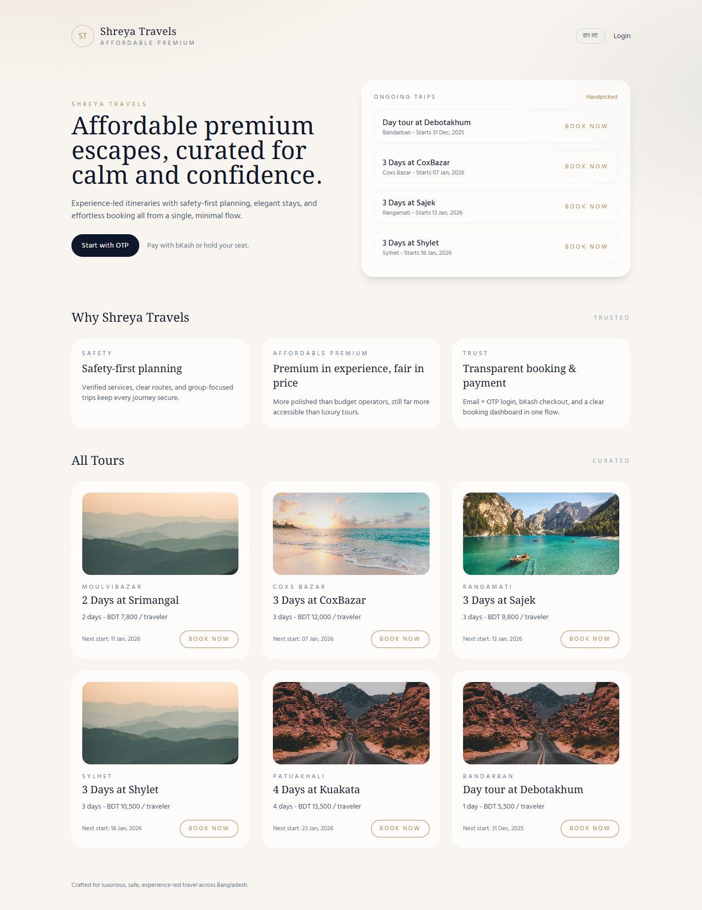

# Shreya Travels (Laravel 12 MVP)

Affordable premium travel booking MVP with OTP-only auth, hold-or-pay booking flow, and bKash payment scaffolding. Designed for Railway.app deployment with Docker, with lightweight observability baked in.

## Live Demo

Live link - https://shreyatravels-production.up.railway.app/

Have patience due to lack of resources, it can get sleep due to inactivity; if you are first visitor within 30 minutes, the website can slow down. Wait for few minutes after first hit.

## Core Features

-   Single landing page with ongoing trips and a tours grid.
-   OTP-only authentication (no password) with cache-based OTPs.
-   Booking modal stepper (OTP -> booking details -> pay/hold).
-   bKash payment scaffolding with callback handling.
-   Admin dashboard with counters, filters, and booking detail view.
-   Minimal observability: slow request + 5xx logging, plus key action logs.
-   Only four DB tables: `users`, `tours`, `bookings`, `payments`.

## Tech Stack

-   Laravel 12 (PHP 8.2+)
-   MySQL 8
-   Blade + Tailwind CDN

| Layer      | Choice                |
| ---------- | --------------------- |
| Backend    | Laravel 12 (PHP 8.2+) |
| Database   | MySQL 8               |
| Frontend   | Blade + Tailwind CDN  |
| Deployment | Docker + Railway      |

## Intent and Architecture

This MVP is intentionally lean: only core business flows, low infrastructure overhead, and clean boundaries that allow growth without redesign.

-   User-facing flow: OTP login -> booking (hold or pay) -> optional bKash payment -> dashboard.
-   Stateful services: MySQL for data, cache for OTPs and throttling.
-   Guard rails: rate limiting on OTP and checkout, admin allowlist, and minimal CSRF exceptions.
-   Observability: log slow requests and server errors, plus key actions (OTP, booking, seeding) to Railway logs.

## Local Setup (No Docker)

1. Requirements: PHP 8.2+, Composer, Node (optional), MySQL running locally.
2. `cp .env.example .env`
3. `composer install`
4. `php artisan key:generate`
5. Set `DB_*` in `.env` for local MySQL.
6. `php artisan migrate --seed`
7. Ensure `MAIL_MAILER=log` for local OTP testing (OTP logs in `storage/logs/laravel.log`).
8. `php artisan serve`
9. Verify checklist:
    - Open `/` and see tours and ongoing trips.
    - Click Book Now -> request OTP -> check logs for OTP -> verify -> booking -> dashboard shows booking.
    - If bKash is not configured, confirm hold-only booking works.
    - Admin: set `ADMIN_EMAILS` in `.env` to your email; login; open `/admin`.
    - Confirm rate limiting returns 429 after repeated OTP attempts.
    - Confirm session expires in 60 minutes (`SESSION_LIFETIME=60`).

## Local Setup (Docker Compose, Recommended)

1. `cp .env.example .env` (set `DB_HOST=mysql`, `DB_PORT=3306`, and DB creds from compose).
2. `docker compose up --build`
3. `docker compose exec app php artisan key:generate`
4. `docker compose exec app php artisan migrate --seed`
5. Visit `http://localhost:8080`
6. OTP appears in logs (`MAIL_MAILER=log`). Repeat the verification checklist above.

## Railway Deploy (Docker)

1. Create a new Railway project and add a MySQL service.
2. Add a new service from this repo (Dockerfile is included).
3. Configure environment variables at App main container > Varaibles tab. Set actual values, get keys from `.env.example`.
4. Ensure `DB_*` values match the Railway MySQL service.
5. Deploy. The container runs migrations and caches on boot via `start.sh`.

## Observability (Minimal)

Railway logs are the primary signal for early-stage debugging.

-   Slow request logging: requests >= `SLOW_REQUEST_MS` (default 1000ms) log as `request.slow`.
-   Server error logging: HTTP 5xx logs as `request.error`.
-   Key actions: OTP requested/verified, booking created, and `/seed-tour` seeding events.

Set `SLOW_REQUEST_MS` in Railway env vars if you want a different threshold.

## SMTP and Mail

-   For local testing, keep `MAIL_MAILER=log` so OTPs go to `storage/logs/laravel.log`.
-   For production, set `MAIL_MAILER=smtp` and provide `MAIL_HOST`, `MAIL_PORT`, `MAIL_USERNAME`, and `MAIL_PASSWORD`.

## OTP Behavior

-   Users are created only after OTP verification.
-   OTPs are cached at `otp:{email}` for `OTP_TTL_MINUTES`.
-   OTP failures are tracked at `otp_fail:{email}` with lockout threshold and window.

## Admin Allowlist

-   Set `ADMIN_EMAILS` as a comma-separated list of emails.
-   Only allowlisted users see the Admin link and can access `/admin`.

## Discount Tokens (No DB)

-   `DISCOUNT_TOKENS` is JSON. Tokens are case-insensitive.
-   Types: `fixed` or `percent`.
-   Minimum payable is always 1 BDT.

Example:

```
DISCOUNT_TOKENS=[{"code":"WELCOME10","type":"percent","value":10,"active":true}]
```

## bKash Notes

-   bKash is disabled if any `BKASH_*` env is missing.
-   When disabled, the pay CTA is inactive and hold-only bookings are allowed.
-   Callback payloads and errors are logged.
-   If you want to simulate locally, set `BKASH_BASE_URL=mock` to redirect to the callback automatically.

## Rate Limit Matrix (Expected Defaults)

| Key                                 | Max | Window (minutes)                   |
| ----------------------------------- | --- | ---------------------------------- |
| LIMIT_OTP_REQ_IP_MAX                | 10  | LIMIT_OTP_REQ_IP_WINDOW (10)       |
| LIMIT_OTP_REQ_EMAIL_MAX             | 3   | LIMIT_OTP_REQ_EMAIL_WINDOW (10)    |
| LIMIT_OTP_REQ_IP_EMAIL_MAX          | 3   | LIMIT_OTP_REQ_IP_EMAIL_WINDOW (10) |
| LIMIT_OTP_VERIFY_IP_MAX             | 20  | LIMIT_OTP_VERIFY_IP_WINDOW (10)    |
| LIMIT_OTP_VERIFY_EMAIL_MAX          | 10  | LIMIT_OTP_VERIFY_EMAIL_WINDOW (10) |
| LIMIT_OTP_FAIL_LOCK_THRESHOLD       | 5   | LIMIT_OTP_FAIL_LOCK_WINDOW (10)    |
| LIMIT_CHECKOUT_USER_MAX             | 10  | LIMIT_CHECKOUT_USER_WINDOW (60)    |
| LIMIT_CHECKOUT_IP_MAX               | 30  | LIMIT_CHECKOUT_IP_WINDOW (60)      |
| LIMIT_BKASH_USER_MAX                | 5   | LIMIT_BKASH_USER_WINDOW (60)       |
| LIMIT_BKASH_IP_MAX                  | 10  | LIMIT_BKASH_IP_WINDOW (60)         |
| LIMIT_BKASH_ACTIVE_INITIATED_WINDOW | n/a | 15                                 |
| LIMIT_ADMIN_USER_MAX                | 60  | LIMIT_ADMIN_USER_WINDOW (1)        |

## Project Notes

-   Timezone is set to `Asia/Dhaka`.
-   Only four migrations exist: `users`, `tours`, `bookings`, `payments`.
-   OTP endpoints return JSON for a clean modal UX.
